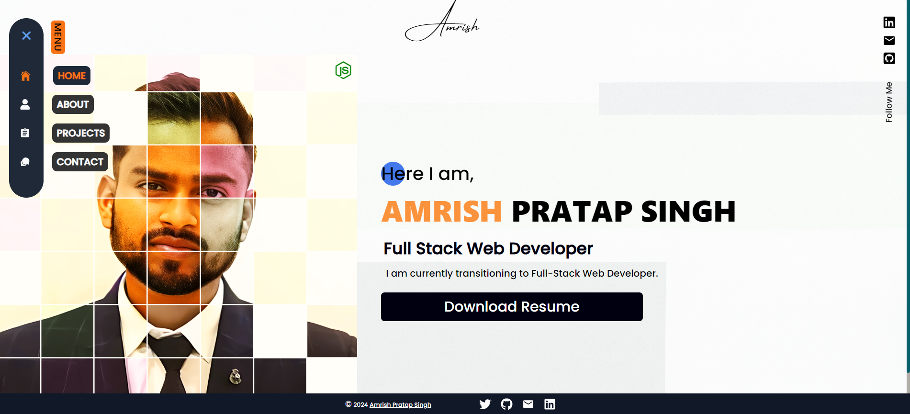

# Portfolio Website

This project is a personal portfolio website built with React and Vite. It showcases the developer's skills, projects, and contact information.

##  About Me
###  Hi, I'm Amrish! 👋
#### I'm a full stack developer[MERN]...

    

## Features

- Home page
- Projects
- Contact
- Responsive design 

## Technologies Used

- React.js
- Vite
- TailwindCSS for styling

## Screenshot

## Demo
Click to Visit!
[My Portfolio [Amrish Pratap Singh]](https://amrishpratapsingh.com)
